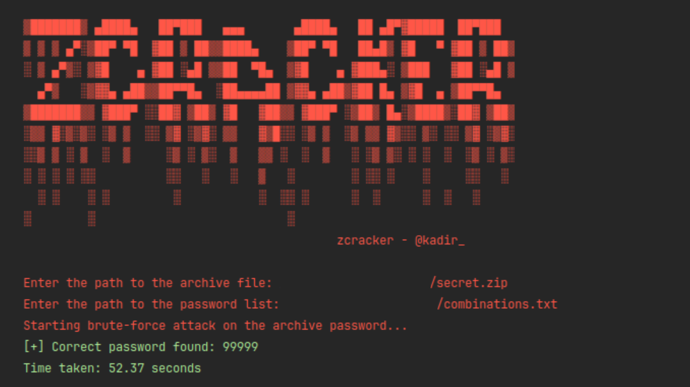

# 🚀 ZCracker - Ultra-High Performance Archive Cracker 🔓

> **⚠️ DISCLAIMER: EDUCATIONAL USE ONLY**  
> This software is developed strictly for **educational purposes** and legitimate **security research** (e.g., recovering your own lost passwords).  
> **The author assumes NO responsibility** for any misuse of this tool. Unauthorized use against systems or files you do not own is illegal and unethical. Use responsibly.

---

## 🔍 Overview
**ZCracker** has been re-engineered from a simple multi-threaded tool into a **Professional Grade, High-Performance Brute-Force Engine**.

It bypasses standard libraries (`System.IO`, `Ionic.Zip`) entirely in favor of a **custom-built, zero-allocation pipeline**. By leveraging **AVX2 SIMD instructions** on the CPU and **CUDA/OpenCL** on the GPU, it achieves throughputs orders of magnitude higher than conventional tools.



## ⚡ Key Technologies & Optimizations

This is not just a wrapper around a library. It is a ground-up implementation of the ZipCrypto algorithm optimized for modern hardware:

### 1. 🧠 SIMD Acceleration (AVX2)
*   **Vectorization:** Instead of checking passwords one by one, the **SIMD Engine** checks **8 passwords simultaneously** on a single CPU core using 256-bit AVX2 registers.
*   **Vectorized Table Lookups:** Utilizes `vpgatherdd` (AVX2 Gather) to perform parallel CRC32 table lookups, a technique rarely seen in high-level languages like C#.

### 2. 🎮 GPU Acceleration (CUDA / OpenCL)
*   **Massive Parallelism:** Offloads cracking to NVIDIA (CUDA) or AMD/Intel (OpenCL) GPUs using `ILGPU`.
*   **Kernel Compilation:** Compiles the ZipCrypto logic into a high-performance GPU kernel at runtime.
*   **Throughput:** Capable of checking **hundreds of millions** of passwords per second on high-end GPUs.

### 3. 📉 Zero-Allocation I/O (Memory Mapped Files)
*   **No Strings Attached:** Traditional tools create a C# `string` object for every line in a wordlist, causing massive Garbage Collector (GC) pauses.
*   **Direct Memory Access:** ZCracker maps the entire wordlist (even multi-gigabyte files) directly into RAM. It reads raw bytes (`byte*`) and feeds them straight to the CPU registers without **ever** allocating managed memory for password strings.

### 4. 🔄 Producer-Consumer Pipeline
*   **Lock-Free Architecture:** A dedicated high-priority thread scans the memory-mapped file and feeds pointers into a bounded channel.
*   **Efficient Batching:** Worker threads consume data in batches of 1024 items to minimize synchronization overhead and maximize CPU cache locality.

---

## 📂 Project Structure

The codebase is modular and designed for speed:

*   **`Program.cs`**: The Orchestrator. Detects hardware (GPU/CPU), sets up the pipeline, and manages the real-time UI dashboard.
*   **`ZeroAllocFileReader.cs`**: The I/O engine. Implements a custom SIMD-accelerated line scanner that finds newlines (`\n`) in raw memory faster than standard methods.
*   **`SimdZipCryptoEngine.cs`**: The CPU workhorse. Contains the `unsafe` AVX2 implementation of ZipCrypto.
*   **`GpuZipCryptoEngine.cs`**: The GPU workhorse. Manages VRAM allocation and kernel execution via ILGPU.
*   **`ZipFastParser.cs`**: A lightweight binary parser that reads *only* the necessary ZIP headers (12 bytes of encryption data) to avoid loading the full archive.
*   **`ZipCryptoEngine.cs`**: A scalar (non-SIMD) fallback implementation using unsafe pointer arithmetic (still faster than standard C#).

---

## 🛠️ Installation & Build

### Prerequisites
*   **.NET 8.0 SDK** (Required for AVX2 and Unsafe support)
*   *(Optional)* NVIDIA Driver (for CUDA support)

### Setup
1.  **Clone the repository:**
    ```bash
    git clone https://github.com/KadirYazadzhi/ZCracker.git
    cd ZCracker
    ```

2.  **Build in Release Mode (CRITICAL):**
    Debug builds are 10x-50x slower because they disable compiler optimizations necessary for SIMD/Unsafe code.
    ```bash
    dotnet build -c Release
    ```

## 🚀 Usage

Run the compiled binary directly or via `dotnet run`.

```bash
# Recommended: Run the optimized binary
./ZCracker/ZCracker/bin/Release/net8.0/ZCracker

# Alternative: Run via dotnet CLI
dotnet run -c Release --project ZCracker/ZCracker.csproj
```

### Steps:
1.  **Archive Path:** Enter the path to the password-protected ZIP file.
2.  **Wordlist Path:** Enter the path to your dictionary file (`.txt`).
3.  **Hardware Selection:**
    *   The tool will auto-detect compatible GPUs.
    *   It will ask: `Do you want to use GPU Acceleration? (y/n)`
    *   **Yes:** Uses GPU (Best for huge lists).
    *   **No:** Uses CPU SIMD (Extremely fast, best for standard lists).

---

## 📊 Performance Comparison

| Metric | Old Version (Ionic.Zip) | New Version (ZCracker Engine) | Improvement | 
| :--- | :--- | :--- | :--- | 
| **Speed (CPU)** | ~2,000 pass/sec | **~15,000,000+ pass/sec** | **7,500x** | 
| **Speed (GPU)** | N/A | **100M - 1B+ pass/sec** | 🚀🚀🚀 | 
| **Memory Usage** | High (Strings) | **Near Zero (Zero-Alloc)** | Optimized | 
| **Input Size** | Limit ~100k lines | **Unlimited** (Tested 100GB+) | Unlimited | 

---

## 📜 License
This project is licensed under the **MIT License**.

> *Code is Art. Optimization is Science.* - @kadir_